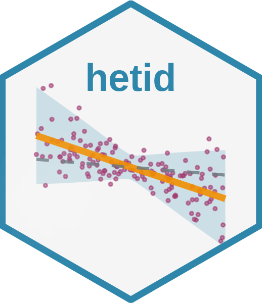

# hetid: Heteroskedasticity Identification



<!-- badges: start -->
[](https://github.com/fernando-duarte/heteroskedasticity_identification/actions/workflows/R-CMD-check.yml)
[](https://github.com/fernando-duarte/heteroskedasticity_identification/actions/workflows/docker.yml)
[](https://github.com/fernando-duarte/heteroskedasticity_identification/actions/workflows/pkgdown.yml)
[](https://github.com/pre-commit/pre-commit)
[](https://app.codecov.io/gh/fernando-duarte/heteroskedasticity_identification)
[](https://github.com/fernando-duarte/heteroskedasticity_identification/actions/workflows/r-security.yml)
<!-- badges: end -->

## Overview

The `hetid` package implements identification through heteroskedasticity methods for models with endogenous regressors. It provides tools for estimation and inference using:

- **Lewbel (2012)**: Identification using continuous heteroskedasticity drivers
  - GMM (Generalized Method of Moments) estimation for both triangular and simultaneous systems
  - Traditional 2SLS (Two-Stage Least Squares) estimation
  - Set identification when point identification assumptions are relaxed
- **Rigobon (2003)**: Identification using discrete regime indicators
  - GMM estimation for regime-based heteroskedasticity
  - 2SLS with regime-based instruments
  - Support for both triangular and simultaneous systems
- **Prono (2014)**: GARCH-based heteroskedasticity identification
  - GMM estimation using conditional variance from GARCH models
  - 2SLS with GARCH-based instruments
  - Support for triangular systems
- **Comparison tools** with other implementations (REndo, Stata)
- **Monte Carlo simulation** to validate theoretical results and bootstrap
- **Visualization tools**

### Applications
- Identification in models with endogenous regressors by heteroskedasticity
- Useful when traditional instruments are unavailable

See the [package website](https://fernando-duarte.github.io/heteroskedasticity_identification/) for complete documentation and examples.

## Quick Start Options

### 🚀 GitHub Codespaces

Get started instantly with a fully configured cloud development environment:

**For Contributors & Developers:**
[](https://codespaces.new/fernando-duarte/heteroskedasticity_identification?quickstart=1)

**For Learners & Exploration:**
[](https://codespaces.new/fernando-duarte/heteroskedasticity_identification?devcontainer_path=.devcontainer/devcontainer-codespaces.json)

**What's Included:**
- ✅ **RStudio Server** (port 8787) - Full IDE experience
- ✅ **VS Code** with R extensions - Modern editor with IntelliSense
- ✅ **Pre-installed dependencies** - All packages ready to use
- ✅ **Interactive examples** - Run demos immediately
- ✅ **Secure environment** - Private ports, authentication enabled

**Getting Started in Codespaces:**
1. Click one of the buttons above
2. Wait 2-3 minutes for environment setup
3. Access RStudio Server via the Ports tab (port 8787)
4. Run `hetid_demo()` to test the package

### 📦 Local Installation

You can install the development version of hetid from GitHub with:

```r
# install.packages("devtools")
devtools::install_github("fernando-duarte/heteroskedasticity_identification")
```

### Note on Vignettes

If you're installing from a path containing spaces (e.g., "Dropbox (Personal)"),
vignettes may not build correctly during installation. To view the vignette
after installation:

```r
# Build vignettes manually if needed
devtools::build_vignettes()

# View available vignettes
browseVignettes("hetid")
```

### Optional Dependencies

For enhanced functionality, you may want to install these optional packages:

```r
# For enhanced table formatting in analysis output
install.packages("knitr")

# For comparison with other Lewbel (2012) implementations
install.packages("REndo")  # Version >= 2.4.0 required
install.packages("AER")    # For ivreg function

# For Stata comparison (if Stata is available)
install.packages("RStata")
install.packages("haven")

# For Prono GARCH-based identification
install.packages("tsgarch")
```

The package will work without these optional dependencies, but installing them provides:
- **knitr**: Nicely formatted tables in analysis functions (when `verbose = TRUE`)
- **REndo**: Comparison with alternative R implementation of Lewbel (2012)
- **AER**: Additional IV regression capabilities
- **RStata/haven**: Comparison with alternative Stata implementation of Lewbel (2012)
- **tsgarch**: GARCH modeling for Prono (2014) time-series identification

### Quick Start

```r
# Install and load
devtools::install_github("fernando-duarte/heteroskedasticity_identification")
library(hetid)

# Quick demonstration
run_lewbel_demo()

# Basic workflow
config <- create_default_config()
data <- generate_lewbel_data(100, config)
result <- run_single_lewbel_simulation(1, config)

# GMM estimation for Lewbel
gmm_result <- lewbel_gmm(data, system = "triangular")
summary(gmm_result)

# GMM estimation for Rigobon
rigobon_data <- generate_rigobon_data(500, list(
  beta1_0 = 0.5, beta1_1 = 1.5, gamma1 = -0.8,
  beta2_0 = 1.0, beta2_1 = -1.0,
  regime_probs = c(0.4, 0.6),
  sigma2_regimes = c(1.0, 3.0)
))
rigobon_result <- rigobon_gmm(rigobon_data)
summary(rigobon_result)

# GMM estimation for Prono
prono_data <- generate_prono_data(500, create_prono_config())
prono_result <- prono_gmm(prono_data)
summary(prono_result)

# Compare GMM with 2SLS
comparison <- compare_gmm_2sls(data)
print(comparison)
```

## Testing

After cloning this repository:

```r
# Quick tests (recommended for contributors)
# In RStudio or after opening R in project directory:
devtools::test()  # Runs CRAN + fast tests

# Or use Make:
make test-fast    # CRAN + fast tests
make test-all     # All tests (10+ minutes)

# Minimal tests only
Sys.setenv(HETID_TEST_LEVEL = "cran")
devtools::test()
```

Note: Opening the project in RStudio or starting R in the project directory
automatically configures the test environment for fast tests.

### Test Organization

The package uses a hierarchical test system:

- **CRAN tests**: Very fast unit tests (< 1 minute total)
- **Fast tests**: Quick tests for development (< 2 minutes)
- **Integration tests**: Multi-component tests (< 5 minutes)
- **Comprehensive tests**: Full validation including Monte Carlo (10+ minutes)

See the [Makefile](Makefile) for all available test commands.

## Guides

**[Development](dev-guides/DEVELOPMENT.md)**.
**[Usage](dev-guides/USAGE.md)**.
**[Troubleshooting](dev-guides/TROUBLESHOOTING.md)**.

## Citation

To cite this package in publications, please use:

```r
citation("hetid")
```

This will show citations for:
- The `hetid` package itself
- Lewbel (2012) - when using heteroskedasticity identification methods
- Rigobon (2003) - when using regime-based identification methods
- Prono (2014) - when using GARCH-based identification methods

## License

This project is licensed under the MIT License - see the [LICENSE](LICENSE) file for details.
